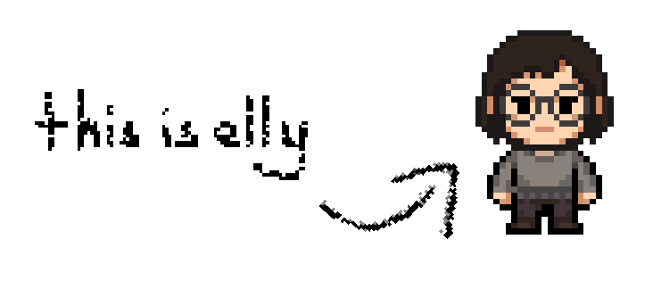

 
## 🙂 About Me

*Water addict.*

I am passionate about all things technology and systems. I consider myself a multidisciplinary creator with a drive to learn, build, and experiment. Here is what I focus on:

* **Content Creation:** I have end-to-end experience creating various types of content. This includes planning strategies, writing scripts, doing voiceovers, editing, and designing thumbnails.
* **Programming:** I've been coding since I was 9 years old. While I spend a lot of time experimenting, my published work includes my portfolio website and a fully functional indie game—a project that tested my combined knowledge of programming, animation, music production, and story-writing. You can find more details on [my website](https://rabug.is-a.dev/projects)!
* **Audio & Music:** Producing music, dubbing, and manipulating audio.
* **Visual Arts:** VFX, 3D modeling, and animation.

While I am constantly learning and don't claim to be a specialized master in just one of these fields yet, I love the journey of improving across all of them.

## 👨‍💻 Tech Stack

| Proficiency | Programming & Development | Design & Production |
|---|---|---|
| **Primary (Rank 1)** | Godot (GDScript), C, JavaScript, SvelteKit, Bevy, Node.js / Bun / Deno | Adobe Suite (Photoshop, Premiere), DaVinci Resolve, Affinity, FL Studio, Blender, Audacity |
| **Secondary (Rank 2)** | C#, Rust, Go, Nix, Unity, Unreal, Drizzle ORM | After Effects, Ocenaudio, Aseprite |
| **Exploring (Rank 3)** | Kotlin, C++, x86 Assembly | *(Always learning!)* |
